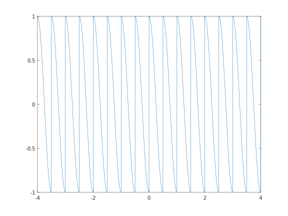
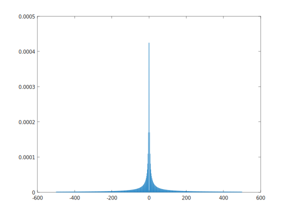
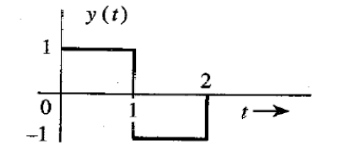

# Generating Square and Cosine Waves Plotting The Resulting Multiplication And Its Fourier Transform

## Code

```matlab
pkg load signal %octave related packge load command delete this if you are using matlab
%Function name: sq 
%Functionality : generate a square wave with a defined numerial period, duration and amplitude
function result = sq(A,t, period)
  result = A*square(2*pi.*t/period);
endfunction
%Function name: co 
%Functionality : generate a cosine wave with a defined numerial period, duration and amplitude
function result = co(A,t, period)
  result = A*cos(2*pi.*t/period);
endfunction

fs = 1000; %sampling rate
t = -4:1/fs:4; %duration
multi = sq(2,t,1) .* co(1,t,1); %multiplication result

plot(t,multi); %plot multiplication
%the same ft procedure we had followed during the tutorial section
N=length(multi);
x=-(-N/2:(N/2)-1)*(fs/N);
multi_ft=fft(multi);
multi_ft_abs= abs(multi_ft);
multi_ft_abs_shift = fftshift(multi_ft_abs/(N/2));


%poltting the fucntion commented out to plot the first graph
%plot(x,2*multi_ft_abs_shift/N);

```

## Results

1- Multiplication of the sine and square waves

 

2- the Fourier transform of the result



## Code Explanation:

**Line 2 to 4** :

```matlab
function result = sq(A,t, period)
  result = A*square(2*pi.*t/period);
endfunction
```

this function was made as a friendly and easy to use interface to the original square function (see sources(1) for a the  full explanation for square() function included in Matlab generating a square with a specific numerical period for a situation when you need a square wave with a period of 2 you won't need to provide the (2\*pi\*.t/period) instead you will just provide the period and duration the same goes for **Line 5 to 7** (see source(2) for the full explanation for cos() function )so it's trivial to reexplain in again.

**Line 8 to 10** : 

```matlab
fs = 1000; %sampling rate
t = -4:1/fs:4; %duration
multi = sq(2,t,1) .* co(1,t,1); %multiplication result
```

defining the sample rate and duration for the cosine and square wave with the following specs and `multi` (the multiplication result)



**Line 9:** `plot(t,multi);`: plotting the result (see result 1)

**Line 10 to 15:** the Fourier transform procedure we followed in the previous tutorial section

**Line 16:** ` %plot(x,2*multi_ft_abs_shift/N);` : plotting the multiplication result  commented out to plot the first graph (see result(2) for the actual results)

## Sources

1- Usage of `square()` function:

> source (the official Matlab documentation): https://www.mathworks.com/help/signal/ref/square.html
>
> `x = square(t)`
> generates a square wave with period 2*π* for the elements of the
> time array `t`. `square` is similar to the sine
> function but creates a square wave with values of –1 and 1.

2- Usage of `cos()` function:

> source (the official Matlab documentation): https://www.mathworks.com/help/matlab/ref/double.cos.html
>
> `Y = cos(X)` returns the cosine for each element of `X`. The `cos function operates element-wise on arrays. The function accepts both real and complex inputs. 
>
> - For real values of `X`, `cos(X)` returns real values in the interval [-1, 1].
> - For complex values of `X`, `cos(X)` returns complex values.

