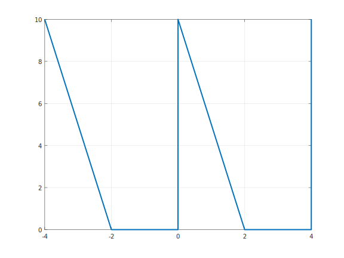

# sec_1_G2 Documentation

## Code:

```matlab
% sec_1_G2 code 
% @Authors:
% Abdullah Khaled Kamal
% Abdulrahman Ragab Hashim
% Hussien Mostafa Said EL-kholy
% Saleh Mahmoud
% Abdallah Muhammed Abd-Almagd
% Mahmoud Hassan Mohamed
% This is a plot for graph G2 for assignment for section 1  
% Refearing to code explanation section for line by line explaination and more inforamtion
time = (-4:1/1000:4); %represents the time period 
s_t= 5/2*(sawtooth(pi*time,0)+1); % generate the saw wave with [peroid = 4] rais it up by 1 to avoid the nigative portion [the magintude] will be discussed thoroughly at code explaination section
s =1+square(0.5*pi*time); % generate square wave and raise it up by one 
wave2 = s_t .* s; 
plot(time,wave2,'LineWidth',2);
grid on
```

## Code Explanation:

line 1: `time = (-4:1/1000:4);`:

initiate the time period for our plot

line 2:`s_t= 5/2*(sawtooth(pi*time,0)+1);` :

* generate the sawtooth (see the next bullet point) wave with `5/2` as a magnitude ,why 5/2? i will separate this part into two parts the  first one (the half part) we raised the plot up by adding 1 which means that our plot will be a double of the original magnitude  the second one (the five part) as a result to line 3 (see line 3 explanation below) our wave will be double in magnitude then we didn't use 10 because the result will be 20 

* the sawtooth function will have a period of 4 due to this definition:

  > source : Matlab official documentation, link: https://www.mathworks.com/help/signal/ref/sawtooth.html
  >
  > `sawtooth(t)`
  > generates a sawtooth wave with period 2*π* for the elements of the
  > time array `t`. `sawtooth` is similar to the
  > sine function but creates a sawtooth wave with peaks of –1 and 1. The sawtooth wave
  > is defined to be –1 at multiples of 2*π* and to increase linearly
  > with time with a slope of 1/*π* at all other times. 

 

line 3:`s =1+square(0.5*pi*time);`:

* generate square (see the next bullet point) wave raised up by one (amplitude = 2) hence the 5 in line two  
* the squarewave function will have a period of 4 due to this definition:
  
  > source: Matlab official documentation, link: https://www.mathworks.com/help/signal/ref/square.html
  >
  > `square(t)`
  > generates a square wave with period 2*π* for the elements of the
  > time array `t`. `square` is similar to the sine
  > function but creates a square wave with values of –1 and 1.

line 4: `wave2 = s_t .* s; `:

multiples the s_t (sawtooth) and s (square) waves resulting the required function

line 5 and 6:`plot(time,wave2,'LineWidth',2);grid on;`:

plot the `wave2` at the vertical axis and `time `  as a horizontal axis with line width of 2 to increase visibility and enable the grid to increase readability 

## Output plot:


