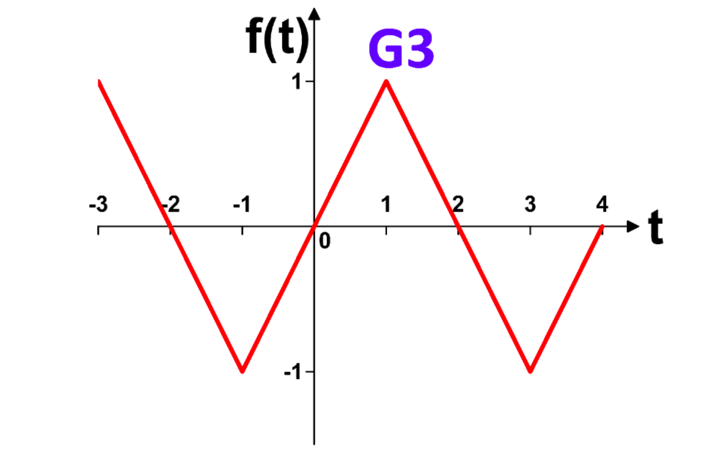
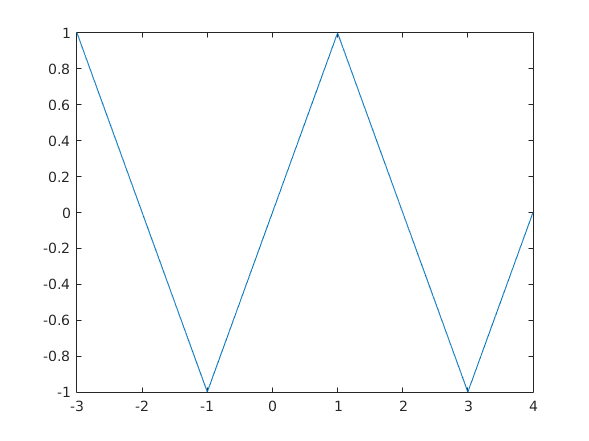

# sec_1_G3 documentation

## plot task description



- function type &rightarrow; triangle wave
- period &rightarrow; 4 s
- frequancy&rightarrow; .25 hz
- phase shift &rightarrow; 1 second  
- \# of periods&rightarrow; 1.75

plot boundry :

- 'x-axis' => -3 : 4
- 'y-axis' =>  1 : 1

\pagebreak

## implemetaion on matlab

### desciption

- define drawed function parameters:
  - freq
  - \# of periods
  - phaseshift
  - sample_rate

```matlab
sample_rate = 1000;
freq = 1/4;
periods = 1.75/freq;
phase_shift=1
```

- generate array for x-axis for values from -3 to 4

```matlab
t = -3: 1/sample_rate: -3+(periods-1/sample_rate);
```

- use sawtooth function with parms

```matlab
 t => 2*pi*freq*(t+phase_shift)
```

```matlab
xmax => .5
```

### full code

```matlab
sample_rate = 1000;
freq = 1/4;
periods = 1.75/freq;
phase_shift=1;

t = -3: 1/sample_rate: -3+(periods-1/sample_rate);
y = sawtooth((2*pi*freq*(t+phase_shift)),.5);

plot(t, y)
```

\pagebreak

### result graph


